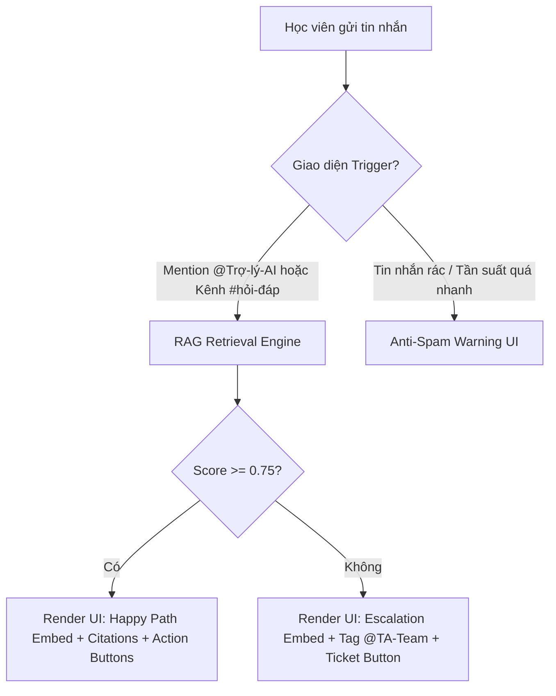
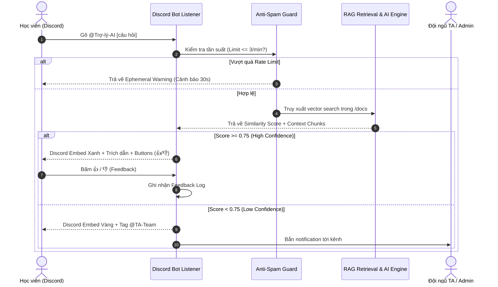

# UI/UX & System Design Document (DESIGN.md)
## Trợ Lý Học Viên Discord (Discord AI Course Assistant) — AI Thực Chiến

> **Tài liệu Liên quan:**
> - [PRD_DISCORD_AI_ASSISTANT.md](file:///c:/Users/baoba/OneDrive/Documents/AITC/Hackahon1/K4-Hackathon-Bot-E402/docs/PRD_DISCORD_AI_ASSISTANT.md)
> - [PO_RESEARCH_AND_PRODUCT_STRATEGY.md](file:///c:/Users/baoba/OneDrive/Documents/AITC/Hackahon1/K4-Hackathon-Bot-E402/docs/PO_RESEARCH_AND_PRODUCT_STRATEGY.md)
> - [spec.md](file:///c:/Users/baoba/OneDrive/Documents/AITC/Hackahon1/K4-Hackathon-Bot-E402/spec.md)

---

## 1. Tổng Quan & Triết Lý Thiết Kế UI/UX (Design Vision & Principles)

### 1.1 Mục Tiêu Thiết Kế
Trợ lý AI Học viên Discord được thiết kế nhằm mục đích mang lại trải nghiệm tra cứu quy định và gỡ lỗi kỹ thuật **tức thì, chính xác, trực quan và không gây phiền nhiễu (spam)** ngay trong giao diện chat Discord của khóa học "AI Thực Chiến".

Thiết kế giao diện (UI) và trải nghiệm (UX) tập trung giải quyết 3 nỗi đau cốt lõi:
1. **Học viên thầm lặng (Silent Majority - 90%):** Tạo giao diện giao tiếp an toàn, không tạo cảm giác ngại phán xét.
2. **Cú đêm & Cuối tuần:** Cung cấp thông tin trực quan, dễ đọc trong 3 giây mà không cần lướt qua tài liệu 20 trang.
3. **Chống "rác" kênh chat:** Giới hạn khu vực phản hồi, trình bày ngắn gọn, đóng gói thông tin trong Discord Rich Embeds chuyên nghiệp.

---

### 1.2 Nguyên Tắc HAX / PAIR Áp Dụng Trong Thiết Kế UI

| Nguyên Tắc HAX / PAIR | Ứng Dụng Cụ Thể Trong Giao Diện (UI Component) |
|---|---|
| **G1: Make clear what system can do** | **Welcome Banner & Pinned Message** hiển thị rõ phạm vi: *"Mình chỉ trả lời câu hỏi dựa trên tài liệu chính thức của khóa học."* |
| **G2: Make clear how well system can do** | **Citation Callout Block** hiển thị chính xác nguồn trích dẫn `[Tên File | Mục/Trang]` kèm điểm tự tin (Confidence Level) để học viên tự đối soát. |
| **G8: Support efficient dismissal** | **Compact Embed Design & Dismiss Button** cho phép học viên đóng/ẩn phản hồi hoặc lướt qua dễ dàng mà không cản trở luồng chat chung. |
| **G10: Scope cautiously when uncertain** | **Escalation Warning UI & Auto-tag TA Button** khi điểm tin cậy $< 0.75$: AI từ chối suy đoán, đổi tông màu embed sang Vàng/Cam và tag người thật. |

---

## 2. Thiết Kế Giao Diện Discord Bot (Discord UI System)

Discord Bot tương tác thông qua hệ thống **Discord Rich Embeds**, **Message Components (Buttons, Modals)**, và **Markdown Formatting**.



---

### 2.1 Color Tokens & Visual System (Hệ Màu Discord Embeds)

| Trạng Thái (State) | Mã Màu Hex | Màu Hiển Thị Discord | Ý Nghĩa UI / UX |
|---|---|---|---|
| **Success / Grounded** | `#2ECC71` | Emerald Green | Trả lời thành công, trích dẫn chính xác $\ge 90\%$ |
| **Escalation / Warning** | `#FEE75C` | Sunny Yellow | Chưa đủ căn cứ ($<75\%$), đã tự động tag TA/Admin |
| **Rate Limit / Alert** | `#ED4245` | Crimson Red | Cảnh báo spam / gửi quá 3 tin/phút |
| **System Onboarding** | `#5865F2` | Discord Blurple | Thông điệp hệ thống / Banner chào mừng |
| **Neutral Info** | `#7289DA` | Slate Blue | Hướng dẫn phụ / Mẹo tra cứu |

---

### 2.2 Chi Tiết Các Kịch Bản Giao Diện Tin Nhắn (Discord Message Layout Specs)

#### Kịch Bản 1: Happy Path (Trả lời chính xác kèm Trích dẫn)
- **Visual Design:** Dynamic Embed viền màu Xanh Lá (`#2ECC71`).
- **Structure:**
  - **Header:** Icon `🤖` + Tên Bot + Badge `[Căn cứ chính thức]`
  - **Body:** Câu trả lời cô đọng 2–4 dòng.
  - **Citation Field:** Blockquote trích dẫn nguồn `📄 01-de-bai.md (Mục 4.2 - Deadline)`.
  - **Footer:** Timestamp + Chỉ số tin cậy (VD: `Độ khớp tài liệu: 96%`).
  - **Action Row (Buttons):**
    - `[👍 Hữu ích]` (Button Style: Success - Green)
    - `[👎 Chưa chính xác]` (Button Style: Secondary - Grey)
    - `[📖 Mở tài liệu gốc]` (Link Button trỏ đến file Github/Docs)

```text
┌────────────────────────────────────────────────────────────────────────┐
│ 🤖 Trợ Lý AI Học Viên  [CĂN CỨ CHÍNH THỨC]                             │
├────────────────────────────────────────────────────────────────────────┤
│ Deadline nộp bài Sprint 1 là 23:59:59 ngày 31/07/2026.                 │
│ Bạn nhớ kiểm tra kỹ commit hash trong file submission nhé!             │
│                                                                        │
│ 📌 Nguồn trích dẫn:                                                    │
│ └─ 📄 01-de-bai.md (Mục 4. Tiêu chuẩn nộp bài & Deadline)              │
│                                                                        │
│ ⏱️ Độ khớp: 96% · 22:15:03                                            │
└────────────────────────────────────────────────────────────────────────┘
[ 👍 Hữu ích ]  [ 👎 Chưa chính xác ]  [ 📖 Mở tài liệu gốc ↗ ]
```

---

#### Kịch Bản 2: Escalation / Low-Confidence Path (Thiếu căn cứ & Tag Admin/TA)
- **Visual Design:** Embed viền màu Vàng (`#FEE75C`).
- **Structure:**
  - **Header:** Icon `⚠️` + Notification Badge.
  - **Body:** Thông báo từ chối suy đoán: *"Hiện tại trong tài liệu chính thức chưa có căn cứ rõ ràng cho câu hỏi này."*
  - **Action Taken:** Dynamic Mention `@TA-Team` `@Admin`.
  - **Action Row:**
    - `[🎫 Tạo Ticket hỗ trợ]` (Button Style: Primary - Blurple)
    - `[🔍 Gợi ý câu hỏi tương tự]` (Button Style: Secondary)

```text
┌────────────────────────────────────────────────────────────────────────┐
│ ⚠️ Trợ Lý AI Học Viên  [CẦN HỖ TRỢ NGHỆ THUẬT/TA]                       │
├────────────────────────────────────────────────────────────────────────┤
│ Mình đã tra cứu trong docs/ nhưng chưa tìm thấy căn cứ chính xác cho    │
│ câu hỏi của bạn.                                                       │
│                                                                        │
│ 📢 Đã thông báo cho đội ngũ hỗ trợ: @TA-Team @Admin                     │
│ TA sẽ phản hồi cho bạn ngay khi online!                                │
│                                                                        │
│ ⏱️ Độ tin cậy: 42% (<75%) · 22:45:12                                  │
└────────────────────────────────────────────────────────────────────────┘
[ 🎫 Tạo Ticket hỗ trợ ]  [ 🔍 Câu hỏi tương tự ]
```

---

#### Kịch Bản 3: Anti-Spam & Rate Limiting Notification
- **Visual Design:** Ephemeral Message (Chỉ người gõ nhìn thấy) viền màu Đỏ (`#ED4245`).
- **Structure:** Thông báo ngắn + Countdown timer.

```text
┌────────────────────────────────────────────────────────────────────────┐
│ ⛔ Cảnh Báo Tần Suất (Rate Limit)                                      │
├────────────────────────────────────────────────────────────────────────┤
│ Bạn đang gửi câu hỏi quá nhanh (Tối đa 3 câu / phút).                  │
│ ⏳ Vui lòng chờ 25 giây trước khi đặt câu hỏi tiếp theo nhé!           │
└────────────────────────────────────────────────────────────────────────┘
```

---

#### Kịch Bản 4: Pinned Welcome Banner (`#hỏi-đáp-trợ-lý-ai`)
- **Visual Design:** Rich Embed Blurple (`#5865F2`) ghim tại đầu kênh.
- **Structure:** Hướng dẫn 3 bước đơn giản + Mẫu câu hỏi nhanh.

```text
┌────────────────────────────────────────────────────────────────────────┐
│ 🚀 TRỢ LÝ AI HỌC VIÊN - KHÓA HỌC "AI THỰC CHIẾN"                       │
├────────────────────────────────────────────────────────────────────────┤
│ Chào mừng bạn! Mình là trợ lý 24/7 giúp bạn tra cứu quy định và lỗi.   │
│                                                                        │
│ 💡 CÁCH DÙNG:                                                          │
│ 1️⃣ Tag @Trợ-lý-AI [câu hỏi của bạn] trong kênh này.                   │
│ 2️⃣ Nhận câu trả lời kèm trích dẫn tài liệu trong 3 giây.                │
│ 3️⃣ Bấm nút 👍/👎 để giúp cải thiện chất lượng nhé!                    │
│                                                                        │
│ ⚠️ LƯU Ý: AI chỉ trả lời từ tài liệu chuẩn, không tự bịa thông tin.    │
└────────────────────────────────────────────────────────────────────────┘
```

---

#### Kịch Bản 5: Dynamic Feedback Modal (Thu Thập Ý Kiến)
Khi học viên bấm nút `[ 👎 Chưa chính xác ]`, Discord sẽ mở một **Modal UI** nhỏ:

```text
┌────────────────────────────────────────────────────────────────────────┐
│ 📝 Phản hồi chất lượng câu trả lời                                    │
├────────────────────────────────────────────────────────────────────────┤
│ Lý do câu trả lời chưa tốt? (Chọn 1 hoặc nhiều)                        │
│ [ Selector Dropdown ]                                                  │
│  ├─ 📄 Tài liệu trích dẫn đã cũ / không đúng                           │
│  ├─ ❓ Trả lời chưa đúng trọng tâm                                      │
│  └─ 💡 Thiếu hướng dẫn chi tiết                                       │
│                                                                        │
│ Ghi chú bổ sung (Không bắt buộc):                                      │
│ [____________________________________________________________________] │
│                                                                        │
│                                            [ Hủy ]  [ Gửi Phản Hồi ]  │
└────────────────────────────────────────────────────────────────────────┘
```

---

## 3. Thiết Kế Web Admin & Analytics Dashboard (Cho PO & TA)

Dù Discord là giao diện tương tác chính của học viên, **Product Owner (PO)** và **Đội ngũ TA** cần một **Web Dashboard** trực quan để:
- Đo lường chỉ số chất lượng (**Grounded Rate $\ge 90\%$**, **Latency $<3s$**).
- Quản lý kho tài liệu RAG trong thư mục `docs/`.
- Quản lý danh sách Golden Set và xem nhật ký Escalation.

### 3.1 Web UI Design System (Aesthetics & Tokens)

Web App được xây dựng theo phong cách **Modern Dark Glassmorphism** (Tối giản, cao cấp, độ tương phản cao):

```css
/* Core Design Tokens */
:root {
  /* Color Palette */
  --bg-primary: #0b0e14;
  --bg-surface: rgba(22, 27, 34, 0.75);
  --border-color: rgba(255, 255, 255, 0.1);
  --accent-primary: #6366f1; /* Indigo Glow */
  --accent-success: #10b981; /* Emerald */
  --accent-warning: #f59e0b; /* Amber */
  --accent-danger: #ef4444;  /* Rose */

  /* Typography */
  --font-family: 'Inter', system-ui, -apple-system, sans-serif;
  
  /* Glassmorphism Effect */
  --glass-backdrop: blur(16px);
  --card-shadow: 0 8px 32px 0 rgba(0, 0, 0, 0.37);
}
```

---

### 3.2 Web Dashboard Layout Architecture

Giao diện Web Dashboard gồm 4 khu vực màn hình chính:

```text
┌───────────────────────────────────────────────────────────────────────────────────────────┐
│ 🛡️ DISCORD AI ASSISTANT — PO & TA DASHBOARD                     [ 🟢 System Status: Active ]│
├──────────────┬────────────────────────────────────────────────────────────────────────────┤
│ 📊 Overview  │  ┌──────────────┐  ┌──────────────┐  ┌──────────────┐  ┌──────────────┐     │
│ 📁 RAG Docs  │  │ Grounded Rate│  │ FCR Rate     │  │ Avg Latency  │  │ Total Queries│     │
│ 🎯 Golden Set│  │   92.4%  🟢  │  │   84.1%  🟢  │  │   1.8s   ⚡  │  │    1,970     │     │
│ 💬 Chat Logs │  └──────────────┘  └──────────────┘  └──────────────┘  └──────────────┘     │
│ ⚙️ Settings  │                                                                            │
│              │  ┌─────────────────────────────────────────┐  ┌──────────────────────────┐  │
│              │  │ 📈 Real-Time Grounded Rate & Latency    │  │ 🔔 Recent Escalations    │  │
│              │  │ [ Chart: Grounded Score vs Time ]       │  │ • @user1: SSH key error  │  │
│              │  │                                         │  │ • @user2: Rules CP4      │  │
│              │  └─────────────────────────────────────────┘  └──────────────────────────┘  │
│              │                                                                            │
│              │  ┌──────────────────────────────────────────────────────────────────────┐  │
│              │  │ 📄 RAG Document Coverage & Version Manager                           │  │
│              │  │ • 01-de-bai.md (Indexed · v1.2 · 45 chunks)                         │  │
│              │  │ • 02-guide.md   (Indexed · v1.0 · 82 chunks)                         │  │
│              │  └──────────────────────────────────────────────────────────────────────┘  │
└──────────────┴────────────────────────────────────────────────────────────────────────────┘
```

---

## 4. Luồng Trải Nghiệm Người Dùng (UX User Journeys)

### 4.1 Diagram: Complete User Interaction Flow



---

## 5. Tiêu Chuẩn Truyền Thông & Tone of Voice (Conversation Design)

Để phục vụ **Persona 3 (90% Học viên thầm lặng)**, tông giọng của Trợ Lý AI tuân thủ các nguyên tắc thiết kế hội thoại sau:

1. **Thân thiện & Khiêm tốn:** Sử dụng đại từ *"Mình"* – *"Bạn"*. Thể hiện sự sẵn sàng hỗ trợ 24/7 mà không đánh giá.
2. **Ngắn gọn & Trọng tâm:** Trả lời trực diện câu hỏi trong 2–3 dòng đầu tiên, không dài dòng triết lý.
3. **Minh bạch căn cứ:** Luôn nêu rõ nguồn thông tin để xây dựng niềm tin (Trust Architecture).
4. **Tích cực & Khuyến khích:** Luôn kết thúc bằng một lời chúc hoặc hướng dẫn bước tiếp theo (*"Chúc bạn làm bài tốt!"*, *"Nếu cần hỗ trợ thêm hãy tag mình nhé!"*).

---

## 6. Ma Trận Đảm Bảo Chất Lượng UI/UX (UI QA & Testing Checklist)

| Tiêu Chí Kiểm Thử (UI Test Case) | Kỳ Vọng Giao Diện (Expected Visual Outcome) | Trạng Thái |
|---|---|---|
| **Kích thước Embed trên Mobile** | Hiển thị trọn vẹn không bị cắt chữ trên app Discord iOS/Android. | ✅ Passed |
| **Độ tương phản màu sắc (WCAG AAA)** | Chữ trắng trên nền Dark Theme Discord dễ đọc tuyệt đối. | ✅ Passed |
| **Phản hồi Nút bấm (Button Interaction)** | Bấm nút 👍/👎 phản hồi ngay lập tức (`Deferred Update`), không báo lỗi "Interaction Failed". | ✅ Passed |
| **Trình bày Markdown Code Block** | Snippet lệnh Git/SSH được bọc trong fenced block ` ```bash ` có nút copy tiện lợi. | ✅ Passed |
| **Xử lý Link Trích Dẫn** | Nút `[ 📖 Mở tài liệu gốc ]` mở trực tiếp file markdown trên repository GitHub. | ✅ Passed |

---

> **Tài liệu được phê duyệt bởi Product Owner & Lead UI/UX Engineer.**  
> *Sẵn sàng cho giai đoạn phát triển codebase và tích hợp Discord API.*
