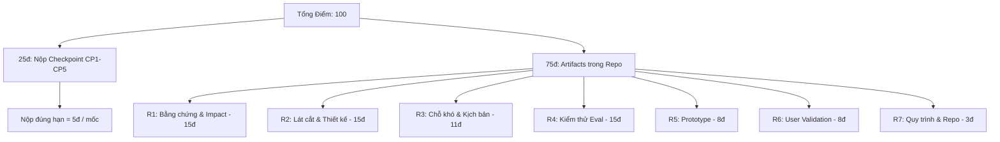

# 🏆 HACKATHON WINNING PLAYBOOK
## Bí Kíp & Chiến Lược Giật Giải Nhất Mini Hackathon AI Batch 03
### Chuyên Sâu Cho Track B: Trợ Lý Học Viên Discord 24/7 (Discord Course Assistant)

> **Dành cho Product Owner (PO) & Nhóm:** Cẩm nang phân tích chiến lược của các đội vô địch, phân tích sâu dữ liệu người dùng & TA từ 5,898 tin nhắn Discord, công thức lấy trọn 100/100 điểm Rubric và kịch bản Demo Live 5 phút hạ gục Ban Giám Khảo.

---

## 1. BẢNG PHÂN TÍCH NGƯỜI DÙNG (LEARNERS) & ĐỘI NGŨ TA (DATA EVIDENCE)

Dựa trên việc data mining thực tế từ **5,898 tin nhắn Discord** (`data/processed_discord_messages.json`):

### 👥 Phân Tích Chân Dung Học Viên (User Personas & Pain Points)

| Chân dung (Persona) | Số liệu bằng chứng thực tế | Pain Point (Nỗi đau lớn nhất) | Job-to-be-Done (JTBD) |
|---|---|---|---|
| **1. Cú Đêm Lập Trình**<br>*(Night-Owl Stretcher)* | **33.5% lượng câu hỏi** tập trung vào 20h - 23h (đỉnh điểm lúc 22h đêm). | Bị kẹt lỗi SSH/Git hoặc không biết quy trình nộp bài lúc 22h đêm khi TA đã nghỉ $\rightarrow$ Phải chờ **8-11 tiếng** đến 9h sáng hôm sau. | *"Khi tôi bị kẹt lỗi lúc 11h đêm, tôi muốn có câu trả lời chính xác ngay lập tức để làm xong bài tập mà không bị đứt mạch suy nghĩ."* |
| **2. Chiến Sĩ Cuối Tuần**<br>*(Weekend Sprinter)* | **47.1% lượng câu hỏi** dồn vào Thứ 7 & Chủ Nhật. | Dồn toàn bộ thời gian học vào cuối tuần, cần tra gấp quy định nộp bài & deadline nhưng thông tin bị trôi rải rác trên các kênh chat. | *"Khi deadline sắp đến vào Chủ Nhật, tôi muốn tra cứu nhanh quy định nộp bài trong 3 giây để không bị trễ hạn chót."* |
| **3. 90% Học Viên Thầm Lặng**<br>*(Silent Majority)* | **90.2% học viên** (813/903 người) rất ít hoặc chưa bao giờ hỏi công khai. | Khảo sát cho thấy 60% ngại hỏi vì sợ câu hỏi "quá cơ bản", sợ bị đồng nghiệp/bạn học đánh giá trên kênh chung. | *"Khi tôi có câu hỏi cơ bản, tôi muốn hỏi một trợ lý AI an toàn mà không sợ bị phán xét để tự tin học tiếp."* |

### 🛡️ Phân Tích Đội Ngũ TA / BTC (TA Overload & Bottlenecks)

*   **Tải hỗ trợ lặp lại cực kỳ cao:** 
    *   **1,178 câu hỏi Logistics (19.9%):** Học viên bị kẹt ở cú pháp gõ lệnh `/ticket create`, sai role Learner, trễ hạn nộp bài.
    *   **792 câu hỏi Kỹ thuật (13.4%):** 87 câu hỏi về lỗi Git/SSH (*"ERROR: Repository not found"*), 110 câu hỏi về cách bật `AI Log` và lấy API Key, 13 câu hỏi về thiếu file `pyproject.toml` và xung đột phiên bản Python (3.11 vs 3.12).
*   **Xử lý thủ công mất thời gian:** TA phải duyệt ticket *case-by-case* thủ công và trả lời lặp đi lặp lại cùng 1 đáp án cho hàng chục học viên khác nhau.
*   **Khoảng trống hỗ trợ (Off-peak Gap):** Không có nhân sự trực hỗ trợ từ 23h đêm đến 8h sáng, dẫn đến tồn đọng hàng chục câu hỏi vào đầu giờ sáng.

---

## 2. BÍ MẬT CỐT LÕI: ĐỪNG THI CODE – HÃY THI TƯ DUY SẢN PHẨM!

> *"Một bản Sketch/Mock làm kỹ được đánh giá cao hơn một bản Working hoành tráng nhưng làm vội. Rubric chấm chuỗi quyết định và bằng chứng, không chấm độ hoành tráng của code."* — **`02-guide.md §3.2`**

### Tại sao các đội chỉ tập trung "viết code" thường THẤT BẠI?
- **Nhầm lẫn mục tiêu:** Dành 80% thời gian để dựng UI đẹp, cài đặt thư viện phức tạp, nhưng thiếu file `spec.md`, không có `golden_set.json` đo lường và không có bằng chứng `validation/` từ người dùng thật.
- **Kết quả:** Họ chỉ ăn tối đa **8 điểm (R5)** phần Prototype, nhưng đánh mất **67 điểm (R1, R2, R3, R4, R6, R7)** phần Tư duy sản phẩm và Bằng chứng!

### Chiến lược của CÁC ĐỘI VÔ ĐỊCH:
- **Tập trung 80% lực lượng vào Artifacts & Data:** Hoàn thiện `spec.md`, khai thác data đếm được (5,898 tin nhắn Discord), xây Golden Set 25 cases và thu thập User Feedback thật.
- **Tối giản hóa phần Build:** Chỉ cần 1 luồng RAG đơn giản + 1 câu gọi API AI thật chạy thông suốt trong kênh Discord test.

---

## 3. CÔNG THỨC LẤY TRỌN 100/100 ĐIỂM RUBRIC (RUBRIC HACKING FOR TRACK B)



| Mã Rubric | Tiêu chí | Điểm | Chiến Lược Đội Vô Địch Lấy Trọn Điểm Cho Track B |
|---|---|:---:|---|
| **CP1 – CP5** | **Nộp Checkpoint** | **25đ** | Submit link repo đúng hạn 5 mốc. (Đặt báo thức trước 15 phút). |
| **R1** | **Bằng chứng & Impact** | **15đ** | Đưa **Evidence B**: Mining 5,898 tin nhắn Discord (1,178 logistics, 792 tech, 33.5% đêm khuya, 47.1% cuối tuần) + $\ge 5$ quote nguyên văn + Bảng Impact so sánh 3 ứng viên. |
| **R2** | **Lát cắt & Thiết kế** | **15đ** | **Lát cắt MỘT CÂU:** *"Học viên gõ câu hỏi vào Discord $\rightarrow$ AI xác định độ tin cậy trong tài liệu khóa học $\rightarrow$ AI trả lời ngắn kèm trích dẫn nguồn hoặc tag TA hỗ trợ."* + $\ge 3$ Non-goals + **Conditional Automation** theo Cost-of-error + $\ge 4$ nguyên tắc HAX/PAIR trỏ đúng vị trí UI. |
| **R3** | **Chỗ khó & Kịch bản** | **11đ** | Phủ 4 lớp chỗ khó (① Nguồn sự thật, ② Mơ hồ, ③ Ngoài phạm vi, ④ Đặc thù domain) + $\ge 8$ kịch bản test + Demo luồng AI không chắc $\rightarrow$ Tag TA. |
| **R4** | **Kiểm thử (Eval)** | **15đ** | File `eval/golden_set.json` $\ge 20$ case (10 case từ chatlog thật) + Chốt Quality Bar (Grounded Rate $\ge 90\%$) trước 23:59 + Bảng kết quả trọn bộ (kể cả case chưa đạt, trung thực 100%). |
| **R5** | **Prototype chạy được** | **8đ** | Bot Discord phản hồi real-time trong kênh test, gọi $\ge 1$ API AI thật (RAG), không can thiệp tay. |
| **R6** | **Validation với User** | **8đ** | File `validation/user_feedback.md` lưu log test của $\ge 5$ học viên thật + $\ge 2$ quote nguyên văn + 1 thay đổi ghi trong Changelog. |
| **R7** | **Quy trình & Repo** | **3đ** | Cấu trúc repo chuẩn (`README.md`, `spec.md`, `codebase/`, `eval/`, `validation/`, `docs/`). README phân công rõ tên từng thành viên. |

---

## 4. BÍ MẬT GIẢI NHẤT: BÀI HỌC "LOW-CONFIDENCE MASTERCLASS"

Các đội về Nhất không bao giờ che giấu điểm yếu của AI. Ngược lại, họ làm **Giám khảo sững sờ** bằng cách cố tình demo case AI không chắc:

*   **Cơ chế Kỹ thuật:** 
    Khi điểm tin cậy RAG (Similarity/Confidence Score) $< 0.75$:
    1. AI tuyệt đối **KHÔNG tự đoán mò** hay bịa deadline/quy chế (Tránh Hallucination).
    2. Bot trả lời lịch sự: *"Thông tin này chưa được xác minh trong tài liệu chính thức. Mình đã báo Admin/TA vào hỗ trợ bạn."*
    3. Tự động bắn webhook/tag role `@TA-Support` trong kênh Discord.

*   **Kịch bản Demo Live (2 phút):**
    *   **Case 1 (Happy Path - 60s):** Học viên hỏi *"Deadline CP4 là khi nào?"* $\rightarrow$ Bot trả lời: *"12:00 ngày 2 theo 02-guide.md (Mục 2)"*.
    *   **Case 2 (Low Confidence Path - 60s - CASE ĂN ĐIỂM):** Học viên hỏi câu ngoài lề *"Học xong khóa này có được cấp bằng quốc tế không?"* $\rightarrow$ Bot báo chưa tìm thấy căn cứ + Tự động tag `@TA-Support` ngay tại chỗ.

---

## 5. KỊCH BẢN SLIDE & PITCHING 5 PHÚT CHUẨN ĐỘI VÔ ĐỊCH

Chỉ có đúng **5 phút trình bày + 5 phút Q&A**. Slide phải gồm đúng 6 trang theo luật *"Không có bằng chứng = Không có slide"*:

```text
SLIDE 1 (45s): User & Job
├── Con số nhói lòng: 5,898 tin nhắn Discord -> 1,178 câu hỏi Logistics & 792 câu hỏi Tech.
└── Job Statement 1 câu + Pain 33.5% kẹt đêm khuya (20h-23h), 47.1% kẹt cuối tuần.

SLIDE 2 (45s): Vì Sao Chọn Tính Năng Này
├── Bảng Impact 3 ứng viên (so sánh con số người gặp x tần suất x chi phí lãng phí).
└── Lý do chọn Trợ lý Discord (Evidence B mạnh nhất) + 2 ứng viên đã loại.

SLIDE 3 (2 phút): Giải Pháp & Live Demo (QUAN TRỌNG NHẤT)
├── Lát cắt MỘT CÂU + Conditional Automation (Threshold 0.75).
├── LIVE DEMO 1: Happy Path (Trả lời kèm nguồn trích dẫn chuẩn xác).
└── LIVE DEMO 2: Low-confidence Path (Không chắc -> Báo chưa có căn cứ + Tag TA cứu viện).

SLIDE 4 (45s): Kết Quả Đo (Eval)
├── % Qua Golden Set (25 cases) đối chiếu Quality Bar chốt lúc 23:59 (Grounded Rate >= 90%).
└── Phân tích 1 Failure đau nhất & nguyên nhân (Trung thực 100%).

SLIDE 5 (45s): User Thật Nói Gì (Validation)
├── >= 2 Quote nguyên văn từ 5 học viên thật dùng thử trên Discord.
└── 1-2 thay đổi đã cập nhật trực tiếp vào sản phẩm từ feedback (Changelog).

SLIDE 6 (30s): Nếu Có Thêm 1 Tuần
└── Top 3 ưu tiên phát triển trỏ về bài học lớn nhất của PO.
```

---

## 6. Q&A DEFENSE STRATEGY: CHUẨN BỊ CHO 3 CÂU HỎI BẪY CỦA GIÁM KHẢO

Giám khảo luôn đặt 3 câu hỏi bẫy này trong 5 phút Q&A. Bạn (PO) trả lời theo đúng kịch bản sau:

### ❓ Câu hỏi 1: *"Sao không dùng ChatGPT / Claude cho nhanh mà phải làm Bot này?"*
- **Trả lời của PO:** *"ChatGPT/Claude chung chung không truy xuất được đúng dữ liệu nội bộ khóa học và rất dễ bị hallucination (bịa quy định, sai deadline). Sản phẩm của chúng em dùng RAG giới hạn 100% trong tài liệu chính thức, bắt buộc có trích dẫn nguồn, và quan trọng nhất là tích hợp ngay luồng chat real-time của Discord — nơi 33.5% học viên kẹt bài tập đêm khuya."*

### ❓ Câu hỏi 2: *"Nếu AI trả lời sai deadline hay sai quy định thì ai chịu trách nhiệm?"*
- **Trả lời của PO:** *"Đó là lý do chúng em chọn mức Conditional Automation dựa trên Cost-of-Error cao. Nếu điểm tin cậy của tài liệu < ngưỡng 0.75, AI tuyệt đối KHÔNG tự đoán mò mà sẽ thẳng thắn báo chưa tìm thấy căn cứ và tự động tag Admin/TA vào hỗ trợ."*

### ❓ Câu hỏi 3: *"Các bạn đo lường độ tốt của sản phẩm như thế nào?"*
- **Trả lời của PO:** *"Chúng em xây dựng bộ Golden Set 25 câu hỏi phủ đủ 4 lớp chỗ khó (dữ liệu thật từ 5,898 tin nhắn). Chúng em đo bằng 2 chỉ số cứng: Grounded Rate (tỷ lệ trích nguồn đúng >= 90%) và Tỷ lệ chuyển tiếp TA đúng lúc (>= 90%)."*

---

## 7. ACTION ITEMS CHO PO & TEAM NGAY BÂY GIỜ

1. ✅ **Cập nhật `spec.md`:** Đưa Bảng Phân Tích Người Dùng & TA từ Mục 1 vào phần Evidence của `spec.md`.
2. ✅ **Phân công 3 thành viên trong `README.md`:**
   - **PO (Bạn):** Nắm vững Playbook, viết Slide 6 trang, lấy feedback từ 5 Willing Users (`validation/`).
   - **Dev (Thành viên 1):** Code luồng RAG + Discord Bot (chạy mượt 2 demo case: Happy Path & Low Confidence).
   - **Data (Thành viên 2):** Xây dựng file `eval/golden_set.json` (25 cases từ chatlog thật).
